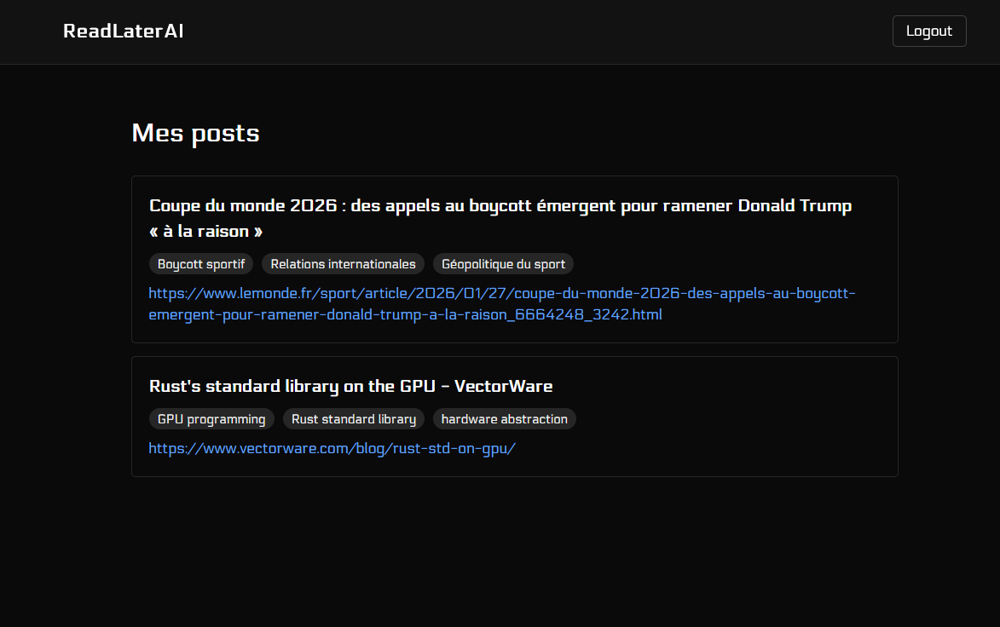
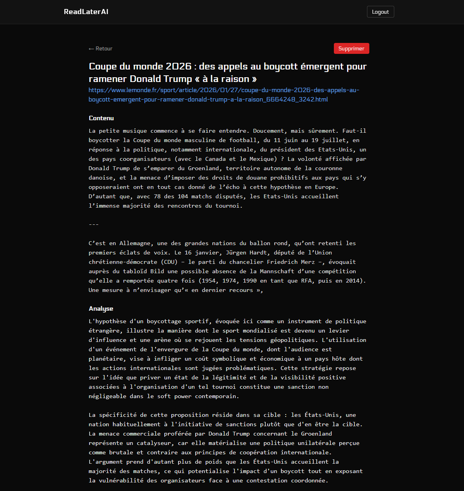

# ReadLater

A personal reading list app with AI-powered content analysis. Save articles, get analysis and tags automatically.

## Stack

- **Frontend**: Next.js 15, TypeScript
- **Backend**: FastAPI, SQLModel
- **Database**: PostgreSQL
- **Infra**: Docker, Terraform (AWS)

## Screenshots



## Local Development

```bash
# Start everything
docker-compose up -d

# Frontend: http://localhost:3000
# API: http://localhost:8000
# API docs: http://localhost:8000/docs
```

## Project Structure

```
api/                 # FastAPI backend
  app/
    routers/         # API routes
    core/            # Background tasks
    services/        # AI integration
frontend/            # Next.js app
extension/           # Chrome extension
terraform/           # AWS infrastructure
scripts/             # Deployment scripts
```

## Deployment

Requires AWS credentials and a key pair for EC2.

```bash
cd terraform
cp terraform.tfvars.example terraform.tfvars
# Edit terraform.tfvars with your values
terraform init
terraform apply
```

Then SSH into EC2 and run `scripts/deploy.sh`.

## Environment Variables

Copy `.env.example` to `.env` and fill in:

- `SECRET_KEY` - JWT signing key
- `DATABASE_URL` - PostgreSQL connection string
- `OPEN_ROUTER_API_KEY` - For AI features

## License

MIT
